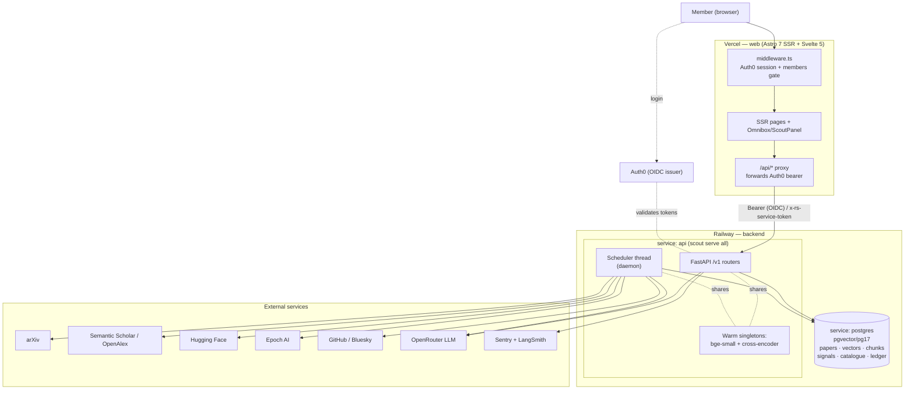
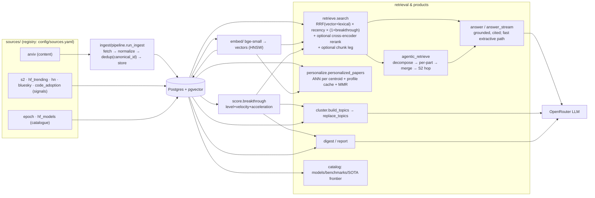
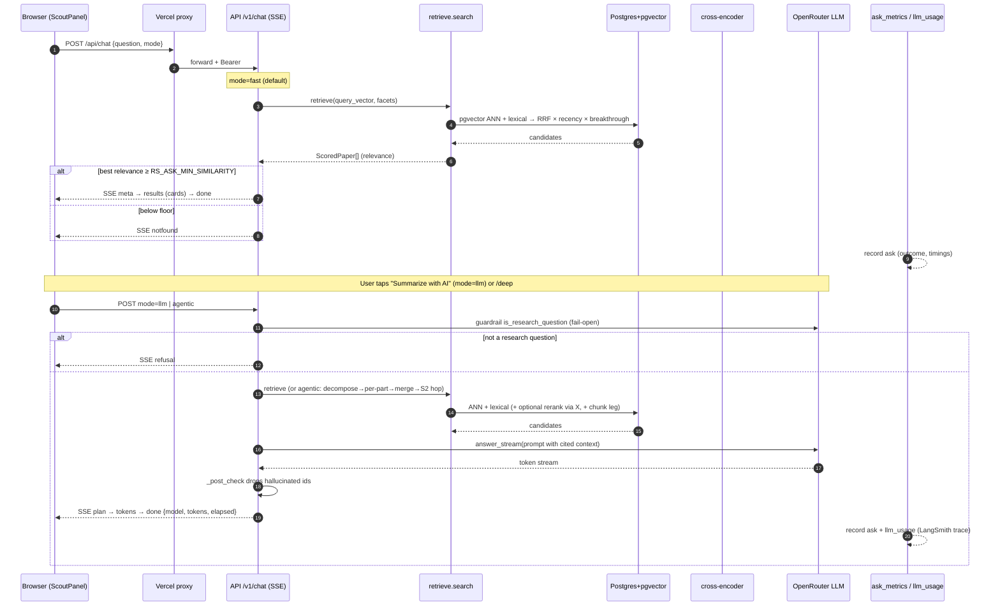
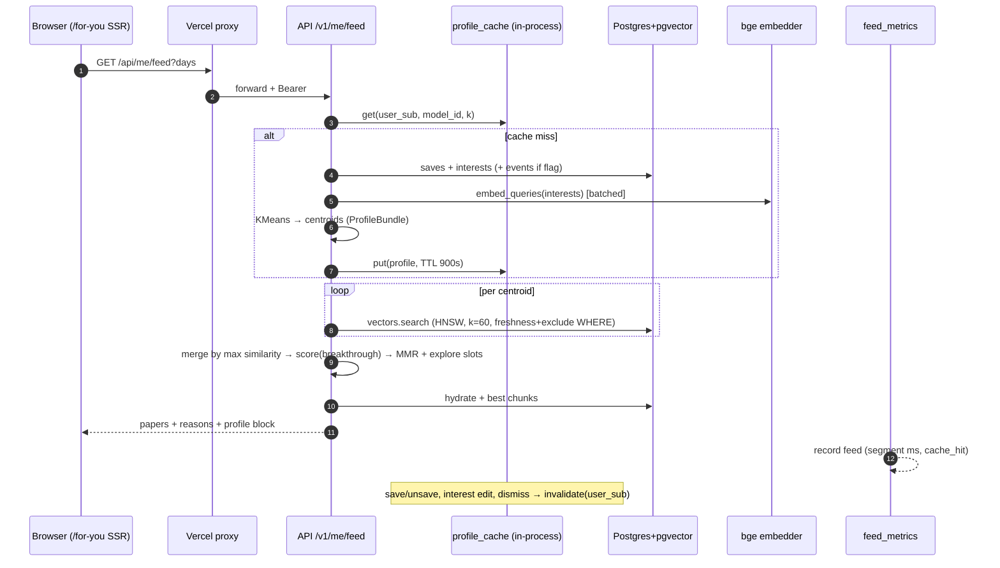
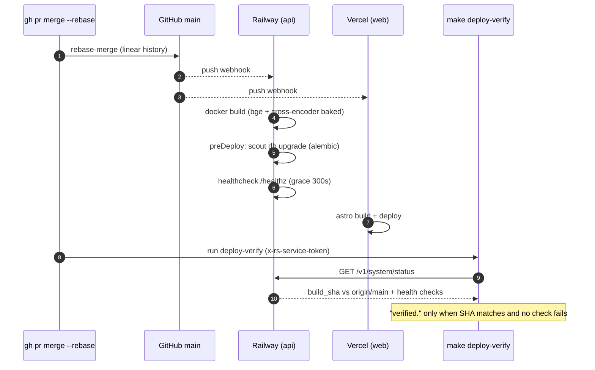

# ResearchScout — architecture & sequence handoff

A source-agnostic radar for AI/ML research: ingest papers and their surrounding signals, score by
multi-signal momentum, cluster into emerging topics, summarize with grounded citations, and
personalize. Diagrams below are Mermaid; they render on GitHub and in most Markdown viewers.

**Stack:** Python 3.12 · FastAPI · SQLAlchemy 2.0 · Postgres 17 + pgvector · local `bge-small`
embeddings · cross-encoder reranker · OpenRouter (OpenAI-compatible) LLM · Astro 7 + Svelte 5 web.
**Prod:** backend on Railway (`api` + `postgres`), web on Vercel, Auth0 OIDC, Sentry + LangSmith.
Verify anything here against the code before treating it as contract — this is a map.

---

## 1. Deployment / system context

One container runs the API **and** the scheduler in-process (`scout serve all`), sharing one warm
embedder. The web tier (Vercel) owns identity and the members-only gate and proxies to the API.



**Auth paths.** Browser → Auth0 login → Vercel seals a session → the proxy forwards the user's
Auth0 **Bearer** to the API, which validates it against the OIDC issuer (`api/auth.py`). Internal
probes (`make deploy-verify`) use the **`x-rs-service-token`** header (`api/service_auth.py`); the
public reads (`/healthz`, `/v1/sources`) need neither. `/v1/system/status` sits behind the service
token in prod — an unauthenticated curl 404s.

---

## 2. Backend components & data flow



**Stores (`store/`):** `papers` · `vectors` (pgvector HNSW) · `chunks` (section-aware, halfvec) ·
`signals` (time series) · `topics` · `digests` · `saved` · `interests` · `events` · catalogue
(`ai_models`, `benchmarks`, `benchmark_results`) · metrics (`ask_metrics`, `feed_metrics`,
`llm_usage`) · `scheduler_runs` (ledger). One filter compiler (`facets.py`) is shared by the feed
and both retrieval legs.

**API routers (`/v1`):** papers · catalog (models/benchmarks/providers) · ask · chat · saved ·
highlights · push · feed · digests · topics · trends · keywords · sources · system · profile · me ·
account · events · stream · webimport.

---

## 3. Sequence — Ask / Chat (fast extractive, then LLM/agentic)

Chat defaults to a fast, LLM-free extractive answer; "Summarize with AI" re-asks in LLM mode;
`/deep` routes through the agentic path. All paths stream Server-Sent Events.



---

## 4. Sequence — Scheduler daily pipeline

Wall-clock slots (America/New_York): pipeline ~00:30, citations ~06:00, report ~07:00, signals
~08:00 & 18:00, topics/daily ~17:00, catalog daily, health every 30 min. Tasks isolate per source;
each writes an open/close row to the `scheduler_runs` ledger; a thread crash exits the process so
Railway restarts it.

```mermaid
sequenceDiagram
    autonumber
    participant S as Scheduler thread
    participant SRC as sources (arXiv/S2/HF/Epoch)
    participant DB as Postgres
    participant E as bge embedder (shared)
    participant L as OpenRouter LLM
    participant LG as scheduler_runs ledger

    Note over S: pipeline slot
    S->>LG: open row (ingest)
    S->>SRC: run_ingest — fetch pages (early-stop)
    SRC-->>S: normalized papers
    S->>DB: dedup(canonical_id) + upsert (commit per page)
    S->>LG: close (ingest)

    S->>DB: categorize — taxonomy + centroid + keywords (+ labels)
    S->>E: index — embed unembedded papers
    E-->>S: vectors
    S->>DB: upsert vectors (HNSW); chunk full text if RS_CHUNK_RETRIEVAL
    S->>SRC: fulltext — arXiv HTML/ar5iv → sections
    S->>DB: papers.full_text + chunk index

    Note over S: later slots
    S->>SRC: citations (S2 batch + OpenAlex fallback, stalest-first)
    S->>DB: signals (HF/HN/Bluesky) → time series → score.breakthrough
    S->>SRC: catalog — Epoch + HF → ai_models/benchmarks
    S->>DB: topics — cluster window vectors → replace_topics (LLM labels via L)
    S->>DB: digest (weekly) / report (daily)
    S->>DB: health self-checks → LG (every 30 min)
```

---

## 5. Sequence — For You v2 feed (request-time ANN + cached profile)

Warm server-side p95 ≈ 169 ms (PR #180). The profile (KMeans centroids over saves + interests +
optional events) is cached in-process for 900 s and invalidated on the user's writes; candidates
come from an HNSW ANN per centroid rather than a full-window scan.



---

## 6. Sequence — Deploy (merge → Railway + Vercel → verify)

Merging to `main` deploys **both** halves. Railway builds the Docker image (weights baked in),
runs `scout db upgrade` as a pre-deploy, and gates on `/healthz`. Vercel builds the web app.



---

## 7. Notes & gotchas

- **One container, shared embedder** (`cli.serve_all`): the scheduler reuses the API's warm bge
  singleton. A scheduler-thread crash calls `os._exit(1)` (after a ledger row + Sentry flush) so
  Railway restarts the whole process — a dead thread behind a healthy `/healthz` would freeze the
  corpus invisibly.
- **Model concurrency** is capped by a blocking semaphore (`modelgate.model_slot`,
  `RS_EMBED_MAX_CONCURRENCY=2`) wrapping every bge/cross-encoder forward pass; LLM generations have
  their own gate (`llmgate`, 503 on no slot).
- **Everything swappable is behind an interface + registry** (Source, Embedder, LLM, Reranker);
  new heavy features default **off** via an `RS_*` flag with the disabled path identical to prior
  behavior.
- **Retrieval scale fact:** stored vectors are bge 384-dim; the static `model2vec` keyword embedder
  is 256-dim and can never mix — both sides of a keyword similarity must come from the same model.
- **Freshness is observable** (as of PR #181): `catalog_freshness` reads `ai_models.refreshed_at`,
  `benchmarks.refreshed_at`, and `topics.built_at`; surfaced on `/v1/system/status`, the pages'
  "data as of" line, and a warn-only health check.
